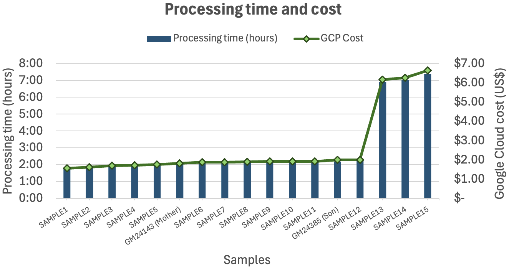
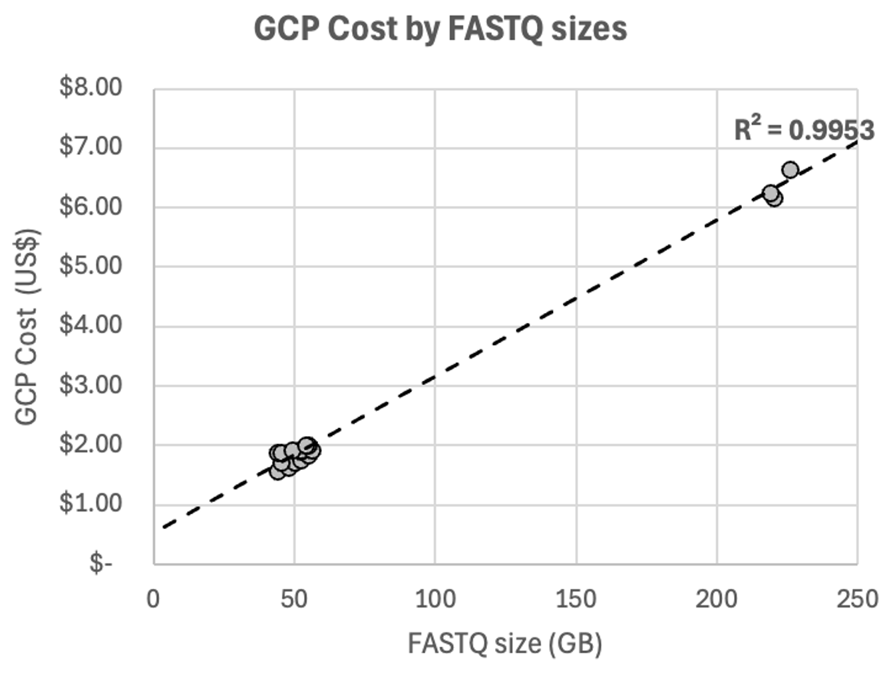

# MVP WGS Germline Pipeline — Google Cloud Platform

A production-ready Nextflow pipeline for running [Illumina DRAGEN](https://www.illumina.com/products/by-type/informatics-products/dragen-secondary-analysis.html) whole-genome analysis at scale on Google Cloud Batch.

DRAGEN performs alignment, variant calling (SNV/INDEL), copy number variant (CNV) detection, structural variant (SV) detection, HLA typing, repeat genotyping, pharmacogenomics (PGx), and multi-region joint detection (MRJD) — all in a single pass per sample.

This pipeline was validated in an **18-sample pilot run on December 19, 2025**, achieving **$1.83/sample (GCP-only costs)** on Spot instances using `c3d-standard-90`, and is designed to scale to **200,000+ samples**.

---

## Table of Contents

1. [Architecture Overview](#architecture-overview)
2. [Repository Structure](#repository-structure)
3. [Prerequisites](#prerequisites)
4. [GCS Data Layout](#gcs-data-layout)
5. [Step-by-Step: First-Time Setup](#step-by-step-first-time-setup)
6. [Running the Pipeline](#running-the-pipeline)
7. [Monitoring](#monitoring)
8. [Outputs](#outputs)
9. [Spot Instance Strategy & Cost](#spot-instance-strategy--cost)
10. [Upgrading DRAGEN](#upgrading-dragen)
11. [Troubleshooting](#troubleshooting)

---

## Architecture Overview

```
┌─────────────────────────────────────────────────────────────────┐
│  GCE VM (head node)                                             │
│                                                                 │
│  nextflow run main.nf --samplesheet my_samples.csv             │
│       │                                                         │
│       │  submits one Cloud Batch job per sample                 │
│       ▼                                                         │
│  ┌──────────────────────────────────────────────────────────┐   │
│  │  Google Cloud Batch  (c3d-standard-90, 2 TB SSD)         │   │
│  │                                                          │   │
│  │  Docker container (Rocky Linux 8 + gcloud CLI)           │   │
│  │       1. Authenticate via GCE metadata service           │   │
│  │       2. Download DRAGEN binary from GCS, install it     │   │
│  │       3. Download reference genome hash table            │   │
│  │       4. Download input FASTQs for this sample           │   │
│  │       5. Run DRAGEN (full WGS analysis)                  │   │
│  │       6. Upload results + MD5 manifest to GCS            │   │
│  └──────────────────────────────────────────────────────────┘   │
│                                                                 │
│  Nextflow manages retries, concurrency, and resume             │
└─────────────────────────────────────────────────────────────────┘
```

**Retry strategy — spot preemption is handled automatically:**

| Attempt | Instance type | Reason |
|---------|--------------|--------|
| 1 | Spot | ~70% cost saving |
| 2 | Spot | Retry after transient preemption |
| 3 | Spot | Final spot attempt |
| 4 | Standard | Guaranteed completion |

Every sample is guaranteed to complete unless DRAGEN itself reports an error.

---

## Repository Structure

```
.
├── main.nf                        # Workflow entry point
├── nextflow.config                # All parameters and defaults
├── conf/
│   └── gcp.config                 # GCP Batch executor, machine, retry config
├── modules/
│   └── dragen/
│       └── main.nf                # DRAGEN process definition
├── app/
│   ├── Dockerfile                 # Container image definition
│   ├── run_dragen.sh              # Core pipeline logic (runs inside container)
│   └── run_dragen_mock.sh         # Dry-run stub — no DRAGEN credits consumed
├── scripts/
│   ├── generate_samplesheet.py   # Sample status tracker and samplesheet generator
│   └── requirements.txt           # Python dependencies for generate_samplesheet.py
├── assets/
│   ├── samplesheet_template.csv             # Samplesheet template
│   └── deployment.params.json.template      # Params file template — copy and fill in before first run
├── secrets/                       # Local copy of credentials (gitignored — never committed)
│   └── dragen_credentials.txt    # DRAGEN BYOL license file (reference copy only)
└── legacy/                        # Pre-Nextflow scripts — kept for reference only
```

> **`secrets/` is excluded from git.** The authoritative copy of `dragen_credentials.txt` lives in GCS at `gs://<bucket>/secrets/dragen_credentials.txt`. The local copy is a reference only.

---

## Prerequisites

### 1. GCP infrastructure (one-time setup)

The following GCP services must be enabled in project `YOUR_PROJECT_ID`:

```bash
gcloud services enable \
  batch.googleapis.com \
  compute.googleapis.com \
  storage.googleapis.com \
  logging.googleapis.com \
  artifactregistry.googleapis.com \
  --project YOUR_PROJECT_ID
```

The service account attached to Cloud Batch VMs needs these IAM roles:
- `roles/storage.objectAdmin` — read inputs, write outputs, read secrets
- `roles/logging.logWriter` — write Cloud Logging entries
- `roles/batch.agentReporter` — required by Cloud Batch agents

### 2. ⚠️ GCP quota increase — MANDATORY before large-scale runs

> **This step is required before running more than ~50 samples in parallel.**

By default, GCP projects have a hard quota on the number of concurrent `c3d-standard-90` VMs in `us-west1` (typically 50–200). At 200k samples, this ceiling will be hit immediately.

**Action required:** Contact your Google account team and request a quota increase for `c3d-standard-90` instances in `us-west1` before starting any large batch. Confirm the new quota in the GCP Console under **IAM & Admin → Quotas** before proceeding.

The `queue_size` parameter in `nextflow.config` controls how many jobs Nextflow submits concurrently — set it to match (or stay safely below) your approved quota.

### 3. Head node GCE VM

Nextflow must run on a **persistent GCE VM** for the duration of a batch. It acts as the job controller — if it goes down, the run pauses (it can be resumed with `-resume`).

Recommended machine type: `e2-standard-2` (2 vCPU, 8 GB RAM) — inexpensive and more than sufficient.

**Install Java and Nextflow:**
```bash
sudo apt-get update && sudo apt-get install -y default-jdk curl
curl -s https://get.nextflow.io | bash
sudo mv nextflow /usr/local/bin/
nextflow -version   # verify installation, requires >=23.10.0
```

**Authenticate with GCP:**
```bash
gcloud auth application-default login
gcloud config set project YOUR_PROJECT_ID
```

### 4. Docker + Artifact Registry

The container image must be built and pushed before the first run. Rebuild it whenever `app/Dockerfile` or `app/run_dragen.sh` changes.

```bash
export PROJECT_ID=YOUR_PROJECT_ID
export REGION=us-west1

# Authenticate Docker with Artifact Registry
gcloud auth configure-docker ${REGION}-docker.pkg.dev

# Build and push
docker build -t dragen-runner:latest -f app/Dockerfile .
docker tag dragen-runner:latest \
  ${REGION}-docker.pkg.dev/${PROJECT_ID}/dragen/dragen-runner:latest
docker push \
  ${REGION}-docker.pkg.dev/${PROJECT_ID}/dragen/dragen-runner:latest
```

---

## GCS Data Layout

All data lives in a single GCS bucket. This layout must be in place before running the pipeline.

```
gs://YOUR_BUCKET/
│
├── secrets/
│   └── dragen_credentials.txt               ← DRAGEN BYOL license file
│
├── tools/
│   └── dragen-softwaremode-4.4.7.el8.x86_64.bin   ← DRAGEN installer binary
│
├── reference/
│   └── hg38-alt_masked.graph.cnv.hla.methyl_cg.rna_v5/  ← Reference hash table
│
├── input_genomes/
│   ├── SAMPLE001/
│   │   ├── SAMPLE001_R1.fastq.gz
│   │   └── SAMPLE001_R2.fastq.gz
│   ├── SAMPLE002/
│   │   └── ...
│   └── ...
│
├── output_files/                             ← Written by the pipeline
│   ├── SAMPLE001/
│   │   ├── SAMPLE001.cram + .crai
│   │   ├── SAMPLE001.hard-filtered.vcf.gz
│   │   ├── SAMPLE001.gvcf.gz
│   │   ├── SAMPLE001.cnv.vcf.gz
│   │   ├── SAMPLE001.sv.vcf.gz
│   │   ├── SAMPLE001.hla.tsv
│   │   ├── *_metrics.csv
│   │   ├── file_manifest.md5
│   │   ├── Software_run_*_usage.txt
│   │   └── logs/
│   └── ...
│
├── tracking/
│   └── sample_tracker.csv                   ← Written by generate_samplesheet.py
│
└── nextflow-work/                           ← Nextflow bookkeeping only (not DRAGEN outputs)
```

**Important naming requirements:**
- Input FASTQs must follow the pattern `*_R1*.fastq.gz` / `*_R2*.fastq.gz`. The pipeline pairs R1 and R2 files automatically.
- Each sample's FASTQs must live in a folder named exactly after the `sample_id` in the samplesheet.
- The DRAGEN binary must be named `dragen-softwaremode-<version>.el8.x86_64.bin` exactly — this name is derived from `params.dragen_version` at runtime.

---

## Step-by-Step: First-Time Setup

This checklist takes a new deployment from zero to first run:

- [ ] Enable required GCP APIs (see [Prerequisites §1](#1-gcp-infrastructure-one-time-setup))
- [ ] Verify service account IAM roles (storage.objectAdmin, logging.logWriter, batch.agentReporter)
- [ ] Request and confirm `c3d-standard-90` quota increase in `us-west1` (**mandatory**)
- [ ] Create and start the head node GCE VM (`e2-standard-2` recommended)
- [ ] Install Java and Nextflow on the head node
- [ ] Authenticate `gcloud` on the head node (`gcloud auth application-default login`)
- [ ] Upload DRAGEN license credentials to `gs://<bucket>/secrets/dragen_credentials.txt`
- [ ] Upload DRAGEN binary to `gs://<bucket>/tools/`
- [ ] Upload reference genome hash table to `gs://<bucket>/reference/`
- [ ] Upload input FASTQs to `gs://<bucket>/input_genomes/<sample_id>/`
- [ ] Build and push Docker image to Artifact Registry
- [ ] Clone this repository onto the head node
- [ ] Install Python dependencies on the head node: `pip install -r scripts/requirements.txt`
- [ ] Fill in `deployment.params.json` from `assets/deployment.params.json.template` (project ID, bucket, GCS paths)
- [ ] Prepare samplesheet CSV (manually or via `generate_samplesheet.py --bucket YOUR_BUCKET`)
- [ ] Run a dry-run test (2–3 samples, `-profile test`) to validate GCP connectivity
- [ ] Run a small real batch (2–3 samples) before the full production run

---

## Running the Pipeline

### Option A — Prepare a samplesheet manually

Create a CSV with one `sample_id` per row. The sample ID must match the folder name under `gs://<bucket>/input_genomes/`.

```bash
cp assets/samplesheet_template.csv my_samples.csv
# Edit my_samples.csv — add one sample ID per line under the header
```

Example:
```
sample_id
SAMPLE001
SAMPLE002
SAMPLE003
```

### Option B — Generate samplesheet automatically (recommended for ongoing ingestion)

`scripts/generate_samplesheet.py` scans GCS for new samples from the sequencing vendor and maintains a persistent status tracker at `gs://<bucket>/tracking/sample_tracker.csv`. All operators share the same tracker.

**Install dependencies on the head node (once):**
```bash
pip install -r scripts/requirements.txt
```

**Check current status (report only, nothing is modified):**
```bash
python scripts/generate_samplesheet.py --bucket YOUR_BUCKET
```

**Generate a samplesheet and mark samples as submitted:**
```bash
python scripts/generate_samplesheet.py --bucket YOUR_BUCKET --submit --out my_samples.csv
```

Sample lifecycle tracked by the script:

| Status | Meaning |
|--------|---------|
| `pending` | Detected in `input_genomes/`, not yet submitted |
| `submitted` | Included in a samplesheet via `--submit` |
| `completed` | `file_manifest.md5` found in `output_files/<sample_id>/` |

Run this script weekly (or on-demand) to capture new vendor deposits. The `-resume` flag in Nextflow provides an additional safety net — if a sample from a previous run appears in the new samplesheet, Nextflow skips it from its local cache.

### Configure deployment parameters

All GCP-specific parameters (`project_id`, `bucket_name`, `work_dir`, `reference_path`, `license_credentials_path`) have no hardcoded defaults and must be supplied at runtime. The recommended approach is a params file — copy the template and fill in your values:

```bash
cp assets/deployment.params.json.template deployment.params.json
# Edit deployment.params.json with your project ID and bucket name
```

### Launch the pipeline

```bash
nextflow run main.nf --params-file deployment.params.json --samplesheet my_samples.csv
```

### Resume after interruption

If the head node VM stopped or the run was interrupted, resume from where it left off — already-completed samples are skipped:

```bash
nextflow run main.nf --params-file deployment.params.json --samplesheet my_samples.csv -resume
```

### Override defaults at runtime

Individual parameters can be overridden on the command line alongside `--params-file`:

```bash
# Limit concurrency (e.g. while quota is being increased)
nextflow run main.nf --params-file deployment.params.json --samplesheet my_samples.csv --queue_size 50

# Specify a different DRAGEN version
nextflow run main.nf --params-file deployment.params.json --samplesheet my_samples.csv --dragen_version 4.4.9

# Use the fastest machine type (prioritise throughput over cost)
nextflow run main.nf --params-file deployment.params.json --samplesheet my_samples.csv --machine_type c4d-standard-96
```

### Dry-run — validate GCP infrastructure without using DRAGEN credits

The `test` profile submits **real Cloud Batch jobs** but replaces the DRAGEN step with a 20-second sleep and dummy output files. Use this to validate GCP authentication, spot VM provisioning, and GCS read/write permissions before a production run. The dry-run uses `e2-standard-4` VMs (no DRAGEN-compatible machine required) and caps concurrency at 5 jobs.

```bash
# Create a small test samplesheet
printf 'sample_id\nTEST001\nTEST002\n' > test_samples.csv

# Submit to GCP with mock DRAGEN (e2-standard-4, max 5 concurrent jobs)
nextflow run main.nf --params-file deployment.params.json --samplesheet test_samples.csv -profile test
```

Dummy output files (including `file_manifest.md5`) are written to `gs://<bucket>/output_files/<sample_id>/` so the run appears completed to `generate_samplesheet.py` as well.

---

## Monitoring

### Live pipeline progress (head node terminal)

Nextflow prints per-sample status to stdout while running. Keep the terminal session alive using `tmux` on the head node — this prevents the run from stopping if your SSH connection drops.

```bash
# Recommended: run inside a tmux session
tmux new -s dragen
nextflow run main.nf --params-file deployment.params.json --samplesheet my_samples.csv
# Detach with Ctrl+B, D — reattach with: tmux attach -t dragen
```

### Cloud Batch job status

```bash
# List all active jobs
gcloud batch jobs list --location=us-west1

# Describe a specific job
gcloud batch jobs describe <job-name> --location=us-west1
```

### Cloud Logging (per-sample logs)

```bash
# Stream recent DRAGEN pipeline logs
gcloud logging read \
  'resource.type="batch.googleapis.com/Job" AND labels."project-name"="dragen-poc"' \
  --project YOUR_PROJECT_ID \
  --limit 100 \
  --format "value(timestamp, textPayload)"
```

Full per-sample DRAGEN logs are also uploaded to GCS at the end of each job:
```
gs://<bucket>/output_files/<sample_id>/logs/
```

---

## Outputs

For each sample, the pipeline writes to `gs://<bucket>/output_files/<sample_id>/`:

| File | Description |
|------|-------------|
| `<sample>.cram` + `.crai` | Aligned reads (CRAM v3.1) |
| `<sample>.hard-filtered.vcf.gz` | SNV/INDEL variant calls |
| `<sample>.gvcf.gz` | GVCF for joint genotyping |
| `<sample>.cnv.vcf.gz` | Copy number variants |
| `<sample>.sv.vcf.gz` | Structural variants |
| `<sample>.hla.tsv` | HLA typing results |
| `*_metrics.csv` | Mapping, coverage, and QC metrics |
| `file_manifest.md5` | MD5 checksums for all output files — also used as the completion sentinel by `generate_samplesheet.py` |
| `Software_run_*_usage.txt` | DRAGEN license usage (Tbases consumed) |
| `logs/` | Full DRAGEN run logs including `stdouterr.txt` |

---

## Spot Instance Strategy & Cost

### Pilot results (December 19, 2025 — 18 samples, us-west1)

The pilot ran 14 jobs in parallel on `c3d-standard-90` Spot instances. Three samples with >140x coverage were included intentionally to stress-test VM configuration (these are the maximum-coverage outliers found in the 200k dataset). 


**Sample performance (c3d-standard-90, Spot):**

| Metric | Value |
|--------|-------|
| **Average processing time** (non-outlier samples) | **2 h 01 min** |
| Min processing time | 1 h 44 min |
| Max processing time (outlier sample) | 7 h 25 min |
| **Average GCP cost** (non-outlier samples)| **$1.83 / sample** |
| Min GCP cost | $1.57 / sample |
| Max GCP cost (outlier sample) | $6.64 / sample |

> * Averages excluded outlier samples from the cost and performance metrics to avoid biasing the results.
> * Costs reflect GCP compute only. Additional DRAGEN licensing costs apply separately.
> * The cost range reflects FASTQ size variation — see [Cost scales linearly with FASTQ size](#cost-scales-linearly-with-fastq-size) below.




### Machine type comparison

Illumina provided benchmarks for 5 supported machine types. Illumina's reference benchmarks are based on 35x WGS. MVP genomes average ~30x, which is why observed costs are slightly lower than the Illumina forecast.

| <nobr>VM size</nobr> | <nobr>Runtime</nobr> | <nobr>Spot</nobr><br><nobr>Cost/sample</nobr> | <nobr>Standard</nobr><br><nobr>Cost/sample</nobr> | Notes |
|---------|---------|--------------|-------------|-------|
| <nobr>n2d-standard-96</nobr> | <nobr>2h 51min</nobr> | <nobr>$3.19</nobr> | <nobr>$10.03</nobr> | |
| <nobr>c3d-standard-60</nobr> | <nobr>3h 15min</nobr> | <nobr>$2.63</nobr> | <nobr>$9.75</nobr> | |
| <nobr>**c3d-standard-90**</nobr> | <nobr>**2h 13min**</nobr> | <nobr>**$2.39**</nobr> | <nobr>**$9.65**</nobr> | **Default — cheapest Spot option** |
| <nobr>c4d-standard-64</nobr> | <nobr>2h 29min</nobr> | <nobr>$3.97</nobr> | <nobr>$8.55</nobr> | |
| <nobr>c4d-standard-96</nobr> | <nobr>1h 44min</nobr> | <nobr>$3.78</nobr> | <nobr>$8.56</nobr> | Fastest — choose if throughput matters more than cost |

> Costs calculated against the project's GCP hourly rates, GCP-only, no DRAGEN licensing:

Spot instances are up to **4× cheaper** than Standard instances. `c3d-standard-90` is the default because it offers the lowest Spot cost per sample. If processing speed is prioritised over economy (e.g. urgent turnaround), switch to `c4d-standard-96`:

```bash
nextflow run main.nf --samplesheet my_samples.csv --machine_type c4d-standard-96
```

### Cost scales linearly with FASTQ size

Illumina confirmed — and the pilot validated (R² = 0.9953) — that both **processing time and GCP cost correlate linearly with FASTQ file size**. This means:
- Cost and runtime estimates scale predictably for any coverage depth.
- High-coverage outlier samples (>140x in the pilot) cost proportionally more and take longer; they are not anomalies.
- For cost forecasting at 200k scale, the average FASTQ size of the cohort is the key input variable.



### Spot preemption handling

Spot VMs can be preempted by Google at any time. The pipeline handles this transparently:

1. **Attempts 1–3** use Spot VMs. Each retry starts fresh — DRAGEN downloads its inputs again and runs from scratch. DRAGEN analysis cannot be checkpointed.
2. **Attempt 4** uses a Standard (on-demand) VM, guaranteeing capacity. Cost is ~4× higher than Spot for that sample.

At scale, most samples will complete on the first or second Spot attempt. The Standard fallback prevents any sample from getting stuck due to sustained regional Spot scarcity.

---

## Upgrading DRAGEN

DRAGEN releases patch versions regularly (e.g. 4.4.4 → 4.4.6 → 4.4.7). To upgrade:

1. Upload the new binary to GCS:
   ```bash
   gcloud storage cp dragen-softwaremode-<new_version>.el8.x86_64.bin \
     gs://YOUR_BUCKET/tools/
   ```

2. Update `dragen_version` in `nextflow.config`:
   ```groovy
   dragen_version = '4.4.9'   // replace with new version
   ```

3. Test on a small batch (2–3 samples) before running at full scale.

> **Note:** The DRAGEN analysis flags in `app/run_dragen.sh` are intentionally not parameterised. They represent the validated production configuration and should only be changed after a formal validation run against a new DRAGEN major release.

> **License quota:** Track cumulative usage against `legacy/20251222_license_quota.json`. Past pilots have exhausted quotas — verify remaining capacity before large runs.

---

## Troubleshooting

**Pipeline exits immediately with "Missing required parameter"**
→ Ensure `--samplesheet` is provided and the file path is correct.

**Jobs fail on all 4 attempts**
→ Check DRAGEN logs in `gs://<bucket>/output_files/<sample_id>/logs/`. Common causes: malformed FASTQs, missing R2 file, reference genome not found, license credentials expired or wrong path.

**All Spot jobs are preempted instantly**
→ `us-west1` may have sustained Spot scarcity for `c3d-standard-90`. Consider temporarily switching machine type or running with `--queue_size 10` to reduce competition.

**Jobs fail with "cannot access bucket" error**
→ The service account attached to Cloud Batch VMs does not have `roles/storage.objectAdmin` on the bucket. Check IAM in the GCP Console.

**Jobs fail with "Failed to download DRAGEN license credentials"**
→ Verify that `gs://<bucket>/secrets/dragen_credentials.txt` exists. The path is controlled by `params.license_credentials_path` in `nextflow.config`.

**Nextflow reports "work directory not writable"**
→ Verify the head node service account has write access to `gs://<bucket>/nextflow-work`.

**Cost significantly higher than $1.83/sample**
→ Three likely causes: (1) a high fraction of samples fell back to Standard instances (attempt 4) — check Cloud Logging for retry counts; (2) the cohort has higher average coverage than the ~30x pilot baseline — cost scales linearly with FASTQ size; (3) sustained Spot scarcity in `us-west1` — consider temporarily reducing `--queue_size` to reduce competition for capacity.

**`generate_samplesheet.py` fails with authentication error**
→ Run `gcloud auth application-default login` on the head node, or ensure the head node's service account has `roles/storage.objectAdmin` on the bucket.
